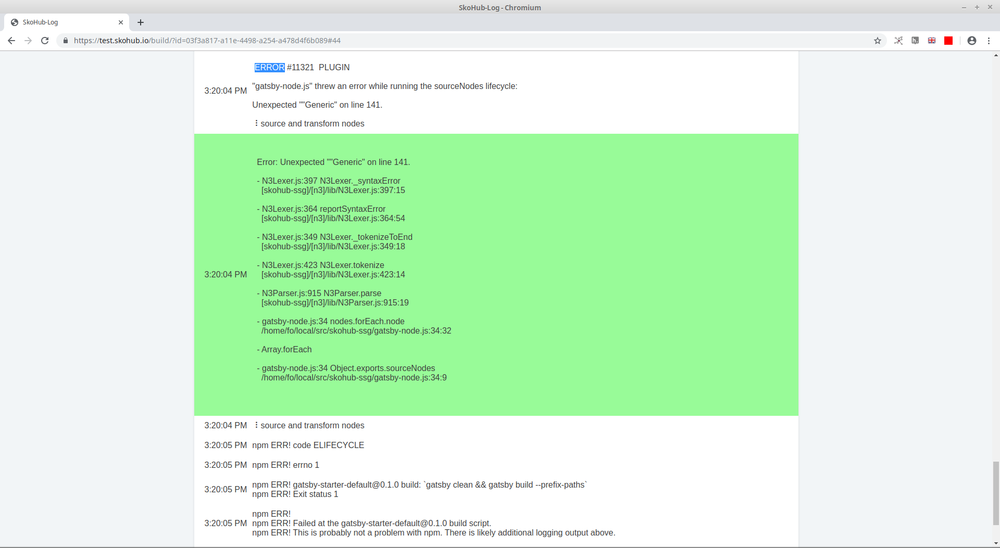
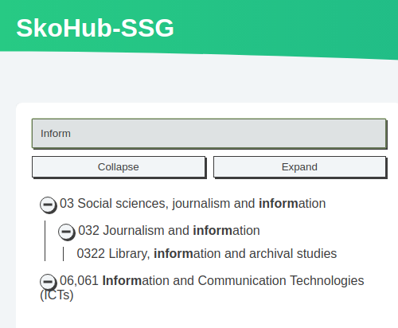

We are happy to announce that the SkoHub prototype outlined in our post ["SkoHub: Enabling KOS-based content subscription"](http://blog.lobid.org/2019/05/17/skohub.html) is now finished. In a series of three post we will report on the outcome by walking through the different components and presenting their features.

SkoHub is all about utilizing the power of Knowledge Organization Systems (KOS) to create a publication/subscription infrastructure for Open Educational Resources (OER). Consequently, publishing these KOS on the web according to the standards was the first area of focus for us. We are well aware that there are already plenty of Open Source tools to [publish](http://skosmos.org/) and [edit](http://vocbench.uniroma2.it/) vocabularies based on [SKOS](https://en.wikipedia.org/wiki/Simple_Knowledge_Organization_System), but these are usually monolithic database applications. Our own workflows often involve managing smaller vocabularies as [flat files on GitHub](https://github.com/hbz/lobid-vocabs), and [others](https://github.com/dcmi/lrmi/tree/master/lrmi_vocabs) seem to also do so.

We will thus start this series with [SkoHub Vocabs](https://github.com/hbz/skohub-vocabs) (formerly called "skohub-ssg"), a static site generator that provides integration for a GitHub-based workflow to publish an HTML version of SKOS vocabularies. Check out the [JAMStack Best Practices](https://jamstack.org/best-practices/) for some thoughts about the advantages of this approach. SkoHub Vocabs – like SkoHub Editor that will be presented in a separate post – is a stand-alone module that can already be helpful on its own, when used without any of the other SkoHub modules.

## How to publish a SKOS scheme from GitHub with SkoHub Vocabs

Let's take a look at the editing and publishing workflow step by step. We will use SkoHub Vocabs to publish a subject classification for Open Educational Resources. We will use the "Educational Subject Classification" (ESC), that was created for the [OER World Map](https://oerworldmap.org) based on [ISCED Fields of Education and Training 2013](http://uis.unesco.org/sites/default/files/documents/isced-fields-of-education-and-training-2013-en.pdf).

### Step 1: Publish vocab as turtle file(s) on GitHub

Currently, a SKOS vocab has to be published in a GitHub repository as one or more [Turtle](https://www.w3.org/TR/turtle/) file(s) in order to be processed by SkoHub Vocabs. ESC is already [available on GitHub](https://github.com/hbz/vocabs-edu/blob/master/esc.ttl) in one Turtle file, so there is nothing to do in this regard. Note that you can also use the static site generator locally, i.e. without GitHub integration; see [below](#implementation) for more about this.

### Step 2: Configure webhook

In order to publish a vocabulary from GitHub with SkoHub Vocabs, you have to set up a webhook in GitHub. It goes like this:

1.  In the GitHub repo where the vocab resides, go to "Settings" → "Webhooks" and click "Add webhook"

2. Enter `https://test.skohub.io/build` as payload URL, choose `application/json` as content type and enter the secret. (Please [contact](http://lobid.org/team/) us for the secret if you want to try it out.)


### Step 3: Execute build & error handling

For the vocabulary to be built and published on SkoHub, there has to be a new commit in the master branch. So, we have to adjust something in the vocab and push it into the master branch. Looking again at the webhook page in the repo settings, you can see a notice that the build was triggered:


However, looking at the build log, an error is shown and the site did not build:



Oops, we forgot to check the vocab for syntax errors before triggering the build and there actually *is* a syntax error in the turtle file. Fixing the syntax in a new [commit](https://github.com/hbz/vocabs-edu/commit/6ab97649874607df7784eaa0787adadbcefde166) will automatically trigger a new build:


This time the build goes through without errors and, voilà, SkoHub has published a human-readable version of the vocabulary at [https://test.skohub.io/hbz/vocabs-edu/heads/master/w3id.org/class/esc/scheme.en.html](https://test.skohub.io/hbz/vocabs-edu/heads/master/w3id.org/class/esc/scheme.en.html). SkoHub Static Site Generator also publishes an [overview](https://test.skohub.io/hbz/vocabs-edu/heads/master/index.en.html) of all the SKOS vocaularies in the GitHub repo.

### Step 4: Redirect vocab URI to SkoHub

As we want the canonical version of ESC to be the one published with SkoHub Vocabs, we need to redirect the namespace URI we defined in the Turtle file to SkoHub. As we used w3id.org for this, we have to make a pull request in the respective repo.

<a href="https://github.com/perma-id/w3id.org/pull/1483"></a>

If everything looks good, w3id.org PRs are merged very quickly, in this case it happened an hour later.

### Result: HTML & JSON-LD representation published with SkoHub & basic GitHub editing workflow

As a result, we have published a controlled vocabulary in SKOS under a permanent URI and with a human-readable [HTML](https://w3id.org/class/esc/scheme.html) representation from GitHub with a minimum amount of work. Additionally, the initial Turtle representation is transformed to more developer-friendly [JSON-LD](https://test.skohub.io/hbz/vocabs-edu/heads/master/w3id.org/class/esc/scheme.json). The HTML has a hierarchy view that can be expanded and collapsed at will:

<a href="https://test.skohub.io/hbz/vocabs-edu/heads/master/w3id.org/class/esc/scheme.en.html"></a>

There also is a search field to easily filter the vocabulary:



This filter is based on a [FlexSearch](https://github.com/nextapps-de/flexsearch) index that is also built along with the rest of the content. This allows us to implement lookup functionalities without the need for a server-side API. More about this below and in the upcoming post on the SkoHub Editor.

## Implementation

To follow along the more technical aspects, you might want to have SkoHub Vocabs checked out locally:

    $ git clone https://github.com/hbz/skohub-vocabs
    $ cd skohub-vocabs
    $ npm i
    $ cp .env.example .env

The static site generator itself is implemented with [Gatsby](https://www.gatsbyjs.org/). One reason for this choice was our good previous experience with [React](https://reactjs.org/). Another nice feature of Gatsby is that all content is sourced into an in-memory database that is available using [GraphQL](https://graphql.org/). While there is certainly a learning curve, this makes the experience of creating a static site not that much different from traditional database-based approaches. You can locally build a vocab as follows:

    $ cp test/data/systematik.ttl data/
    $ npm run build

This will result in a build in `public/` directory. Currently, the build is optimized to be served by Apache with [Multiviews](https://httpd.apache.org/docs/2.4/mod/mod_negotiation.html) in order to provide content negotiation. Please note that currently only vocabularies are supported that implement the [slash namespace](https://www.w3.org/2001/sw/BestPractices/VM/http-examples/2006-01-18/#slash) pattern. We will add support for hash URIs in the future.

In order to trigger the static site generator from GitHub, a small webhook server based on [Koa](https://koajs.com/) was implemented. (Why not [Express](https://expressjs.com/)? – It wouldn't have made a difference.) The [webhook](https://developer.github.com/webhooks/) server listens for and validates POST requests coming from GitHub, retrieves the data from the corresponding repository and then spins up Gatsby to create the static content.

A final word on the FlexSearch index mentioned above. An important use case for vocabularies is to access them from external applications. Using the FlexSearch library and the index pre-built by SkoHub Vocabs, a lookup of vocabulary terms is easy to implement:

```
<script src="https://cdnjs.cloudflare.com/ajax/libs/FlexSearch/0.6.22/flexsearch.min.js"></script>

<script>
  fetch('https://w3id.org/class/esc/scheme', {
    headers: { accept: 'text/index'}
  }).then(response => response.json())
    .then(serialized => {
    const index = FlexSearch.create()
    index.import(serialized)
    console.log(index.search("philosophy"))
  })
</script>
```

Note that currently the index will only return URIs associated with the search term, not the corresponding labels. This will change in a future update.

*Updates:*

* *Edit 2021-02-05: Update some URLs because with [implementing internationalization](https://github.com/skohub-io/skohub-vocabs/issues/79) for the HTML pages, SkoHub Vocabs URLs changed.*