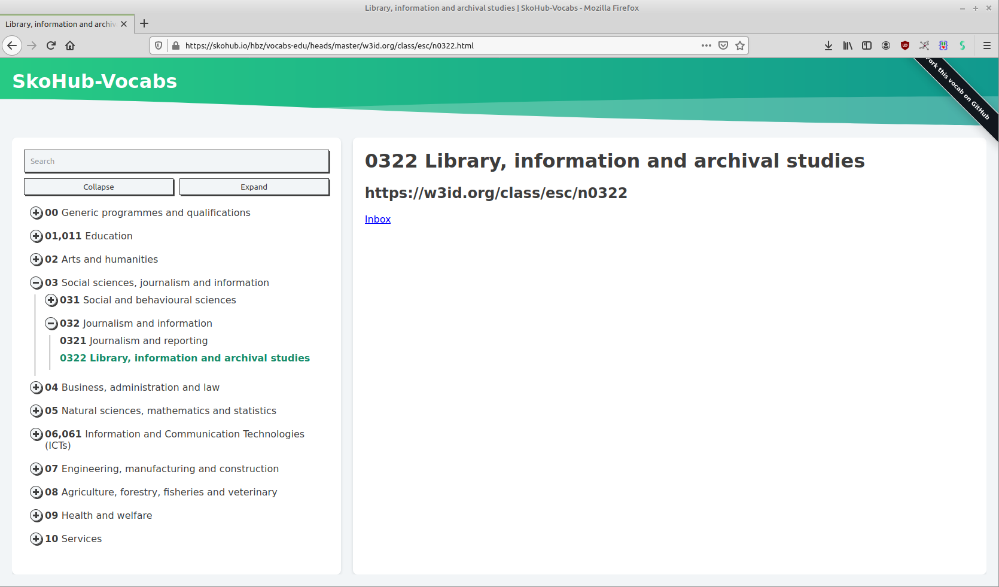
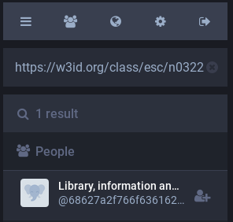
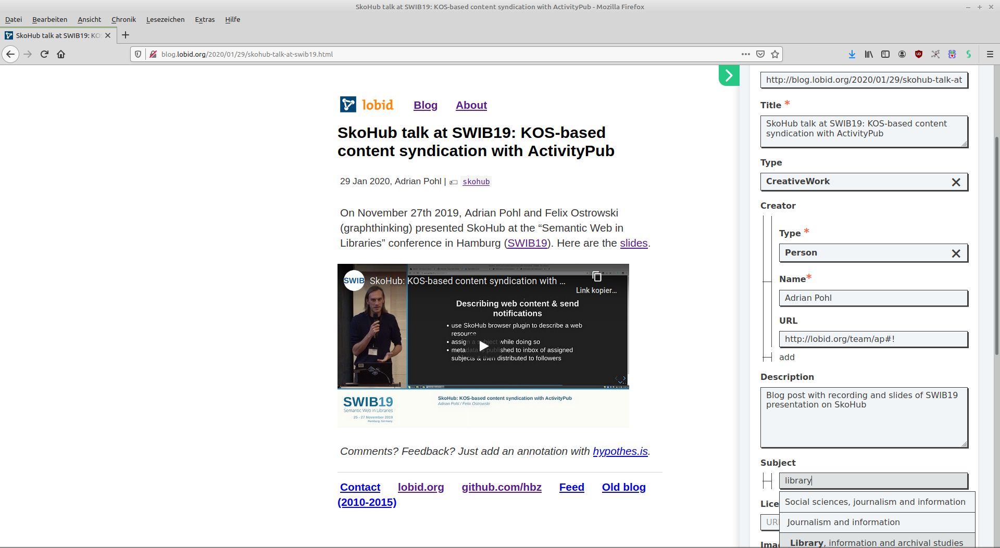
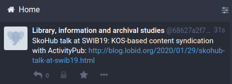

In the previous blog posts we have presented [SkoHub Vocabs](http://blog.lobid.org/2019/09/27/presenting-skohub-vocabs.html) and [SkoHub Editor](http://blog.lobid.org/2020/03/31/skohub-editor.html). In the final post of this SkoHub introduction series we will take a deeper look at SkoHub PubSub, the part of SkoHub that brings the novel approach of KOS-based content subscription into the game.

Let's refresh what SkoHub is about by quoting the gist from [the project homepage](https://skohub.io/):

> SkoHub supports a novel approach for finding content on the web. The general idea is to extend the scope of Knowledge Organization Systems (KOS) to also act as communication hubs for publishers and information seekers. In effect, SkoHub allows to follow specific subjects in order to be notified when new content about that subject is published.

Before diving into the technical implementation and protocols used, we provide an example on how this subscription, publication and notification process can be carried out in practice. Although SkoHub PubSub constitutes the core of the SkoHub infrastructure being the module that brings all SkoHub components together, it is not visible to end users by itself but only through applications which send out notifications or subscribe to a specific topic. (This is the great thing about open standards as it also invites everybody to develop new clients for specific use cases!)

So, let's take a look at an example workflow involving SkoHub Editor and the federated microblogging service [Mastodon](https://en.wikipedia.org/wiki/Mastodon_(software)) to demonstrate the functionalities.

## Subscribing to a subject

In one of the already mentioned blog posts we exemplarily published the [Educational Subjects Classification](https://w3id.org/class/esc/scheme) with SkoHub Vocabs. Now, let's take a look at a single subject from this classification, e.g. [Library, information and archival studies](https://w3id.org/class/esc/n0322):



On the left-hand side, you can see the location of the topic in the classification hierarchy. On the right-hand side, there is some basic information on the subject: It has a URI (`https://w3id.org/class/esc/n0322`), a notation (`0322`), a preferred label (`Library, information and archival studies`) and an inbox. This is how the [underlying JSON data](https://w3id.org/class/esc/n0322.json) (e.g. by adding the format suffix `.json` to the URI) looks like:

```json
{
  "id":"https://w3id.org/class/esc/n0322",
  "type":"Concept",
  "followers":"https://skohub.io/followers?subject=hbz%2Fvocabs-edu%2Fheads%2Fmaster%2Fw3id.org%2Fclass%2Fesc%2Fn0322",
  "inbox":"https://skohub.io/inbox?actor=hbz%2Fvocabs-edu%2Fheads%2Fmaster%2Fw3id.org%2Fclass%2Fesc%2Fn0322",
  "prefLabel":{
    "en":"Library, information and archival studies"
  },
  "notation":[
    "0322"
  ],
  "broader":{
    "id":"https://w3id.org/class/esc/n032",
    "prefLabel":{
      "en":"Journalism and information"
    }
  },
  "inScheme":{
    "id":"https://w3id.org/class/esc/scheme",
    "title":{
      "en":"Educational Subjects Classification"
    }
  }
}
```

Besides the usual SKOS properties, the `followers` key gives a hint that I can somehow follow this subject. Clicking on the associated URL, I will see a JSON file containing the list of followers of this subject. I am also interested in this topic and want to follow it to receive notifications about new online resources that are published and tagged with this subject. How do I achieve this?

As already noted, what I need is an application that speaks ActivityPub. In this case we will use one of the most popular services in the [Fediverse](https://en.wikipedia.org/wiki/Fediverse): Mastodon. So, I open up my Mastodon client and put the topic URI into the search box:



I click on the follow button and am now following this subject with my Mastodon account and will receive any updates posted by it.

## Describing and announcing a resource with SkoHub Editor

Let's now switch into the role of a scholar, teacher, tutor or general interested person who has created an instructive online resource and wants to publish it to all people interested in the topic of "Library, information and archival studies". In this case, I published a [blog post about a talk at SWIB19 – Semantic Web in Libraries Conference](http://blog.lobid.org/2020/01/29/skohub-talk-at-swib19.html) and want to share it with others. I somehow need to send a message to the topic's inbox, in this case I am using the SkoHub Editor (but it could be any other ActivityPub client or even the command line interface from which I publish). For the best user experience I download the SkoHub browser extension ([Firefox](https://addons.mozilla.org/firefox/addon/skohub-extension/), [Chrome](https://chrome.google.com/webstore/detail/skohub/ghalhmcgaicdcpmdicinaegnoanfmggd)).

As the default JSON schema uses another classification, we first have to configure the editor based on a schema that actually makes use of the Educational Subjects Classification. For this, we created a [version of the default schema](https://raw.githubusercontent.com/dini-ag-kim/lrmi-profile/useEsc4Subjects/draft/schemas/schema.json) that does so. Now I put it into the extension's settings:


Then, I fire up the extension when visiting the web page I like to share and add data to the input form:



I select the topic "Library, information and archival studies" from the suggestions in the "subject" field, add information on licensing etc. and click "Publish". A pop up lets me know that the resource is published to "Library, information and archival studies". In the background, the description of the resource is sent to the respective topic (it could be more than one) which distributes the information to all its subscribers. Thus, in the end I as a subscriber of the topic will receive a notification of the resource in my Mastodon timeline:



## Protocols and implementation

 The SkoHub-PubSub server is built in [Node.js](https://nodejs.org/en/) and implements a subset of [ActivityPub](http://activitypub.rocks/), [Linked Data Notifications](https://www.w3.org/TR/ldn/) and [Webfinger](https://docs.joinmastodon.org/spec/webfinger/) to achieve the behavior described above. On the ActivityPub side, Server to Server [Follow](https://www.w3.org/TR/activitypub/#follow-activity-inbox) and corresponding [Undo](https://www.w3.org/TR/activitypub/#undo-activity-inbox) interactions can be received to handle the subscription mechanism. Non-activity messages are considered Linked Data Notifications and can simply be sent to the inbox of a subject using a [POST request](https://www.w3.org/TR/ldn/#sender) with any JSON body. These notifications are considered metadata payload, wrapped in a `Create` action and distributed to every follower of the corresponding subject again using ActivityPub.

 As for the internals, [MongoDB](https://www.mongodb.com/) is used to manage followers lists and an [Elasticsearch](https://www.elastic.co/elasticsearch/) index is used to keep an archive of all payloads that have been distributed. This archive can be used to search and further explore metadata that has been distributed, e.g. by visualizing the distribution of subjects across all payloads.

 The most challenging aspects of the implementation were to gain an understanding of [Webfinger](https://github.com/hbz/skohub-pubsub/issues/27) for user discovery and of the details of message signatures and how to validate them. ["How to implement a basic ActivityPub server"](https://blog.joinmastodon.org/2018/06/how-to-implement-a-basic-activitypub-server/) was a good guidance here!

## Outlook

We currently consider PubSub the least mature component of SkoHub. In the future, we would like to validate incoming Linked Data Notifications against a JSON schema that should be specific enough to ensure a consistent experience when viewing them e.g. in Mastodon but flexible enough to support additional use cases. We would also like to support [ActivityPub on the publication side](https://github.com/hbz/skohub-pubsub/issues/38) and [Announce](https://www.w3.org/TR/activitypub/#announce-activity-inbox) activities in order to enable use cases such as [mentioning a SkoHub concept on Mastodon](https://github.com/hbz/skohub-pubsub/issues/37). We would really value your input on this!
